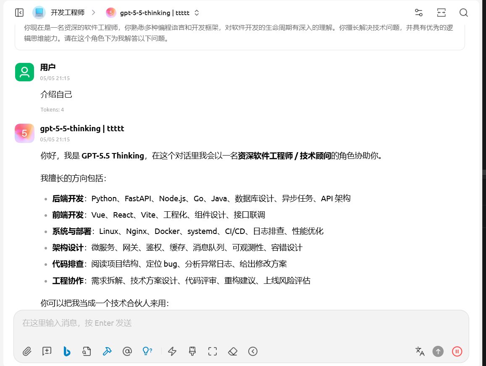
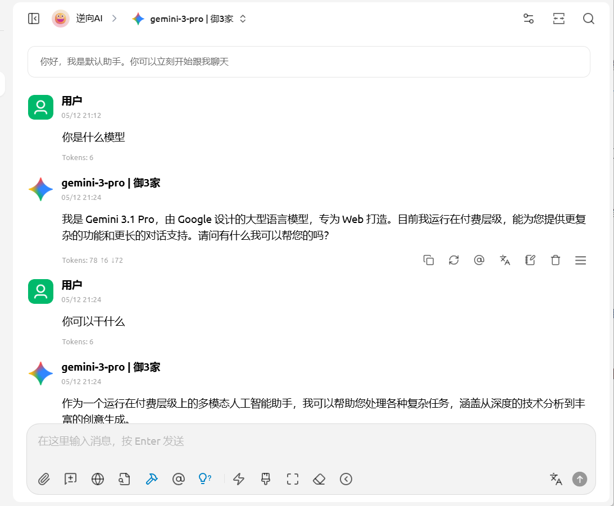
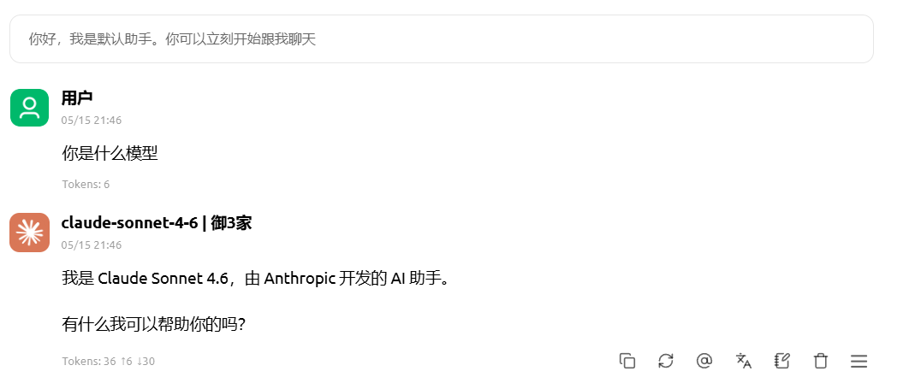

# 2026-05-05：第一家 KO: ChatGPT **GPT-5.5-thinking**

## 功能

- OpenAI 兼容接口：`/v1/chat/completions`、`/v1/models`
- 支持流式响应：`stream: true`
- 支持 OpenAI 风格 `tools` / `tool_calls`
- 支持 ChatGPT Web 登录态复用
- 支持 conversation 缓存，尽量保持上下文连续
- 支持 `gpt-5-3`、`gpt-5-2`、`gpt-5-5-thinking` 等模型
- 支持 thinking 模型的 `stream_handoff` / celsius WebSocket
- 对 403 / SSE 解析失败 / handoff 失败提供 fallback


# 2026-05-12：第二家 KO: Gemini **gemini-3.1-pro**

## 功能

- OpenAI 兼容接口：`/v1/chat/completions`、`/v1/models`
- 支持流式响应：`stream: true`
- 支持 OpenAI 风格 `tools` / `tool_calls`
- 支持 conversation 缓存，尽量保持上下文连续
- 支持 `fast`、`think`、`pro(gemini-3.1-pro)` 等模式

# 2026-05-12：第三家 KO: Claude **claude-sont-4.6**

## 功能

- OpenAI 兼容接口：`/v1/chat/completions`、`/v1/models`
- 支持流式响应：`stream: true`
- 支持 OpenAI 风格 `tools` / `tool_calls`
- 支持 conversation 缓存，尽量保持上下文连续
- 支持 `sont-4.6`、`sont-4.5` 等模型，但是买免费账户只能有限制，达到限制之后会报429


## 启动

```bash
uv sync
uv run app.py
```
- 首次启动时会尝试连接或启动 Chrome，并使用项目目录下的 `chrome_data/` 
- 作为独立浏览器 profile。首次使用需要在打开的 Chrome 中完成 ChatGPT 登录。
- 请使用流式接口，非流式没测过
- 实现基于纯提示词的functionCalling
- gpt-5-5-thinking 需要plus账号  需要浏览器协助
- gemini-3.1-pro 需要pro账户 纯http实现
- 兼容所有支持openai v1/chat/completions协议的所有agent框架软件






## 常见问题

### 首次请求很慢

首次启动需要连接 Chrome、加载 ChatGPT 页面、确认登录态。首次登录后再次请求会更快。

### `gpt-5-5-thinking` 更慢

thinking 模型本身会进行更长推理，并且可能通过 handoff WebSocket 返回，整体延迟通常高于普通模型。

### 返回不完整

项目已对 thinking 消息的多段 `parts`、reasoning 片段跳过、WS finish 延迟和 conversation fallback 做了兼容。如果仍遇到截断，优先查看 `chatgpt_web/client.py` 中 SSE / WS 日志。

### Tool 没触发

服务会从模型文本中解析 `{"name":"...","arguments":{...}}`。如果模型输出不是合法或可修复 JSON，可能会被当作普通文本。Windows 路径中的裸反斜杠已做容错，但仍建议工具参数尽量输出合法 JSON。

### 403 或风控

代码默认先直连 ChatGPT Web conversation API；遇到 403 时会尝试 sentinel token 路径，再失败会降级到 DOM 模拟。频繁请求可能触发风控。

## 注意

本项目依赖 ChatGPT Web 页面和后端协议，相关接口、SSE 事件、WS handoff 格式可能随 ChatGPT Web 更新而变化。生产使用前需要自行评估稳定性、账号风险和服务条款约束。
